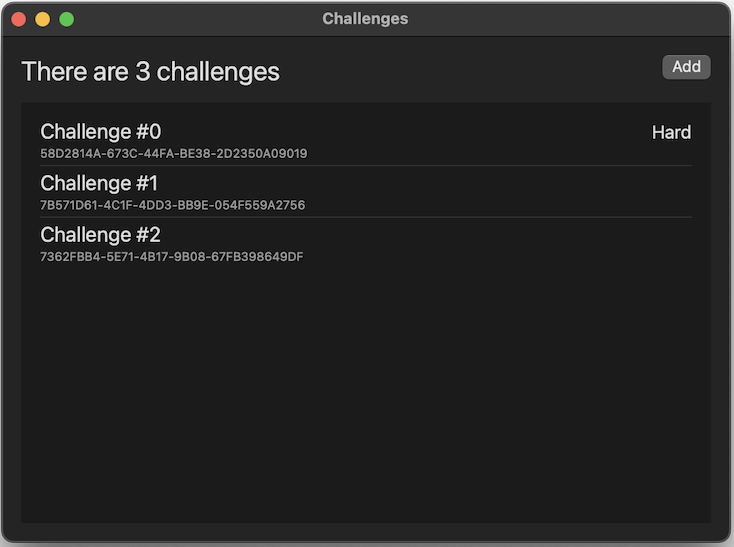
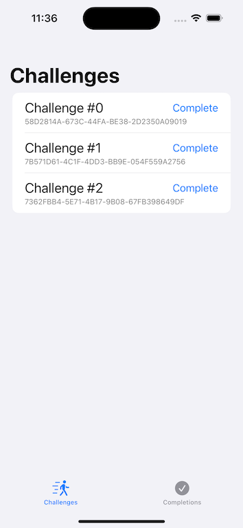
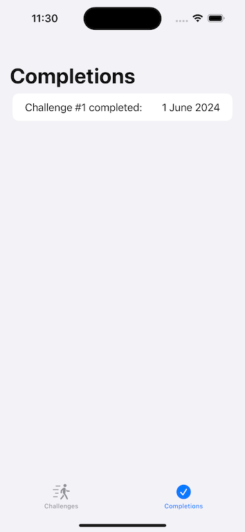

# Vacuum Test
Built and tested using Xcode 15.4, macOS 14.5, and iOS 17.5 (simulator).

# TL;DR
Use a macOS app to pre-populate a SwiftData database that you then process with the `sqlite3` command line tool before bundling the processed database in an iOS app that uses the pre-populated data.  All paths assume you are in the root directory of this repository.

1. Build and run the [**CreateData**](https://github.com/keithsharp/VacuumTest/tree/main/CreateData) macOS app.  Add as many challenges as you want and then export (*File -> Export* or &#8984;-e) the data to a new SwiftData database in the `exports` directory.
2. If there's an existing database at `VacuumTest/Data/challenges.store`, delete this with the command `rm VacuumTest/Data/challenges.store`.
3. Run the command `sqlite3 exports/challenges.store`.
4. Within `sqlite3` run the command `VACUUM INTO 'VacuumTest/Data/challenges.store';`.
5. Build and run the [**VacuumTest**](https://github.com/keithsharp/VacuumTest/tree/main/VacuumTest) iOS app.  You should see the same list of challenges that you created in the CreateData app.

# Background
The basic premise is that you are building an iOS app that you plan on shipping through the App Store and your app needs to ship pre-loaded with data.  For example, imagine a recipe app that ships with hundreds or even thousands of recipes pre-installed.  There are a number of ways you could do this.

You could ship the recipes as one or more JSON files and then parse these at runtime to build your app's model.  However, there are two potential issues with this: firstly the parsing might take a long time giving a poor user experience on app startup; and secondly loading all of the recipes into memory each time your app runs will lead to a higher chance of it being killed when it's backgrounded, with the knock on effect of having to cold start on resume leading to a poorer user experience.

A variation on this would be to detect when the user first runs your app (using something like [`@AppStorage`](https://developer.apple.com/documentation/swiftui/appstorage)), parse the JSON files, and then populate a SwiftData database.  The problem with this approach is that it might take a significant period of time to perform this parsing and writing, leading to a poor user experience when they first launch the app.  You may also face complexity when considering how to ship an update of your app with additional recipes.

Rather than shipping the data with the app, you could take the approach of hosting the data online and then having your app download the data when it runs.  This approach has many challenges: performance on first run - you'll probably hit the same issues with regards to JSON parsing as mentioned previously as well as the network performance overhead; handling the case where the user has no network connection; building caching logic so that you don't need to hit the network each time your app runs.  HHowever, using this approach comes with the advantage that you can update the data your app uses without having to submit a new version of your app to the App Store.

A final option would be to distribute your app's data using [CloudKit](https://developer.apple.com/documentation/cloudkit).  This works well, but has the requirement that your user needs to be online and the additional requirement that your user needs to be signed in to their Apple ID.

In this repository I demonstrate the approach of shipping a pre-populated [SwiftData](https://developer.apple.com/documentation/swiftdata) database.  This approach has the benefit of a very good user experience - the data is all present and ready immediately; it works whether the user is online and offline.  There is the downside that the build process for your app has additional steps and when you want to update the data your app uses, you'll need to submit a new version through the App Store.

## Standing on the shoulders of giants
When I was originally investigating how to ship a pre-populated SwiftData database I came across this [article by Paul Hudson](https://www.hackingwithswift.com/quick-start/swiftdata/how-to-pre-populate-an-app-with-an-existing-swiftdata-database).  The article notes that there is an issue because SwiftData uses SQLite with [Write Ahead Logging (WAL)](https://www.sqlite.org/wal.html) and suggests a workaround of using [Core Data](https://developer.apple.com/documentation/coredata/) within the app you use to create your pre-populated database and then SwiftData in the app that uses this database.  However, this hits problems as your data model becomes more complex - Core Data is an older technology based on [Objective-C](https://en.wikipedia.org/wiki/Objective-C) and as a result it doesn't play very nice with more complex Swift data types such as [Enums](https://docs.swift.org/swift-book/documentation/the-swift-programming-language/enumerations/) and [Structs](https://docs.swift.org/swift-book/documentation/the-swift-programming-language/classesandstructures/), it also uses a different technique for storing Swift [collection](https://developer.apple.com/documentation/swift/collections) types than that used by SwiftData.

After battling with the Core Data approach for a while, I eventually took to [social media](https://hachyderm.io/@keithsharp) to ask that [Apple add a feature to make this simpler](https://hachyderm.io/@keithsharp/112523662708332089).  This led to a [suggestion](https://hachyderm.io/@groue/112524440062602440) from [Gwendal Roué](https://hachyderm.io/@groue) to use the SQLite [`VACUUM`](https://www.sqlite.org/lang_vacuum.html) command to convert a SQLite database with WAL into one without, I could then bundle the database with my app.  **The advantage of this approach is that I can use SwiftData in both my data preparation app and my data consumer app**.

## Data preparation
The repository contains a macOS app called [**CreateData**](https://github.com/keithsharp/VacuumTest/tree/main/CreateData).



The app is very simple - use the add button to add new challenges and swipe left with two fingers on a challenge to delete the challenge.  Internally the app is using SwiftData to store the challenges you add - if you quit and restart the app your challenges will still be present.

When you've added enough challenges you can export the data using the menu *File -> Export* or the keyboard shortcut &#8984;-e.  This will save your data in a new SwiftData database.  This new database also has WAL enabled and is not suitable for bundling in the iOS app.  To convert the database to one with WAL disabled, switch to the terminal and run the [`sqlite3`](https://sqlite.org/cli.html) shell.  Once in the `sqlite3` shell, use the `VACUUM` command to create a new database with WAL disabled.  Your terminal should look something like:
```sh
$ sqlite3 exports/challenges.store
SQLite version 3.43.2 2023-10-10 13:08:14
Enter ".help" for usage hints.
sqlite> VACUUM INTO 'VacuumTest/Data/challenges.store';
sqlite>
```

## The iOS application
The repository contains an iOS app called [**VacuumTest**](https://github.com/keithsharp/VacuumTest/tree/main/VacuumTest).  If you build and run the app in the simulator you should see the same list of challenges that you created in the CreateData app in macOS.




You can mark challenges as complete and these will then show up in the completions tab.  Completions can be deleted by swiping left.  The app uses a second SwiftData database to store the completions, linking these to the corresponding challenge by UUID.  Stopping and restarting the app should show the same list of challenges and completions.

The advantage of using a separate database for the user generated completions is that when you ship a new version of the app you don't have to worry about overwriting user data, though you would still have to handle migrations if you changed the models used for the user data ([`CompletionRecord`](https://github.com/keithsharp/VacuumTest/blob/main/VacuumTest/CompletionRecord.swift) in this example).  The disadvantage of this approach is that you have to maintain the link between the UUID of a challenge and the UUID of the challenge that is stored in the `CompletionRecord`.

# Copyright and license
Copyright 2024, Keith Sharp &lt;[kms@passback.co.uk](mailto:kms@passback.co.uk)&gt;.

Permission is hereby granted, free of charge, to any person obtaining a copy of this software and associated documentation files (the “Software”), to deal in the Software without restriction, including without limitation the rights to use, copy, modify, merge, publish, distribute, sublicense, and/or sell copies of the Software, and to permit persons to whom the Software is furnished to do so, subject to the following conditions:

The above copyright notice and this permission notice shall be included in all copies or substantial portions of the Software.

THE SOFTWARE IS PROVIDED “AS IS”, WITHOUT WARRANTY OF ANY KIND, EXPRESS OR IMPLIED, INCLUDING BUT NOT LIMITED TO THE WARRANTIES OF MERCHANTABILITY, FITNESS FOR A PARTICULAR PURPOSE AND NONINFRINGEMENT. IN NO EVENT SHALL THE AUTHORS OR COPYRIGHT HOLDERS BE LIABLE FOR ANY CLAIM, DAMAGES OR OTHER LIABILITY, WHETHER IN AN ACTION OF CONTRACT, TORT OR OTHERWISE, ARISING FROM, OUT OF OR IN CONNECTION WITH THE SOFTWARE OR THE USE OR OTHER DEALINGS IN THE SOFTWARE.